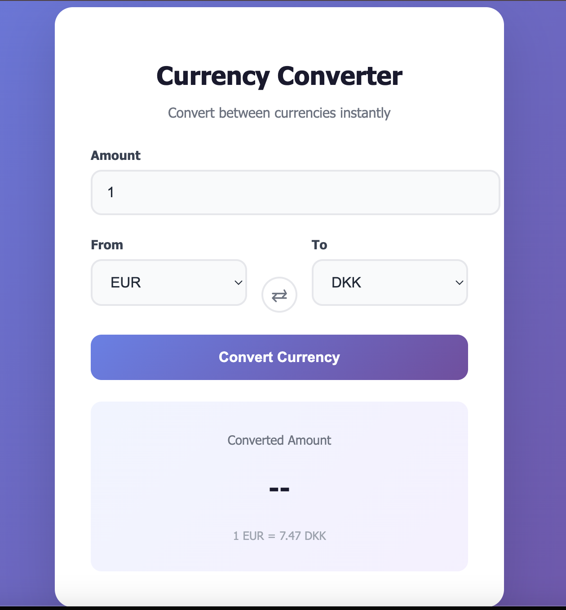

# 💱 Currency Converter

A simple currency converter built with JavaScript that fetches real-time exchange rates and allows users to convert between different currencies.

## 🚀 Features

- Convert between currencies using live exchange rates
- Select both source and target currencies
- Enter custom amount
- Swap currencies functionality
- Clean and responsive UI

## 🛠️ Technologies Used

- HTML
- CSS
- JavaScript (Fetch API)

## 📸 Screenshot

## 💡 What I learned

- Working with APIs using fetch and Promises
- DOM manipulation without using innerHTML
- Creating dynamic UI elements
- Improving user experience with validation and feedback

